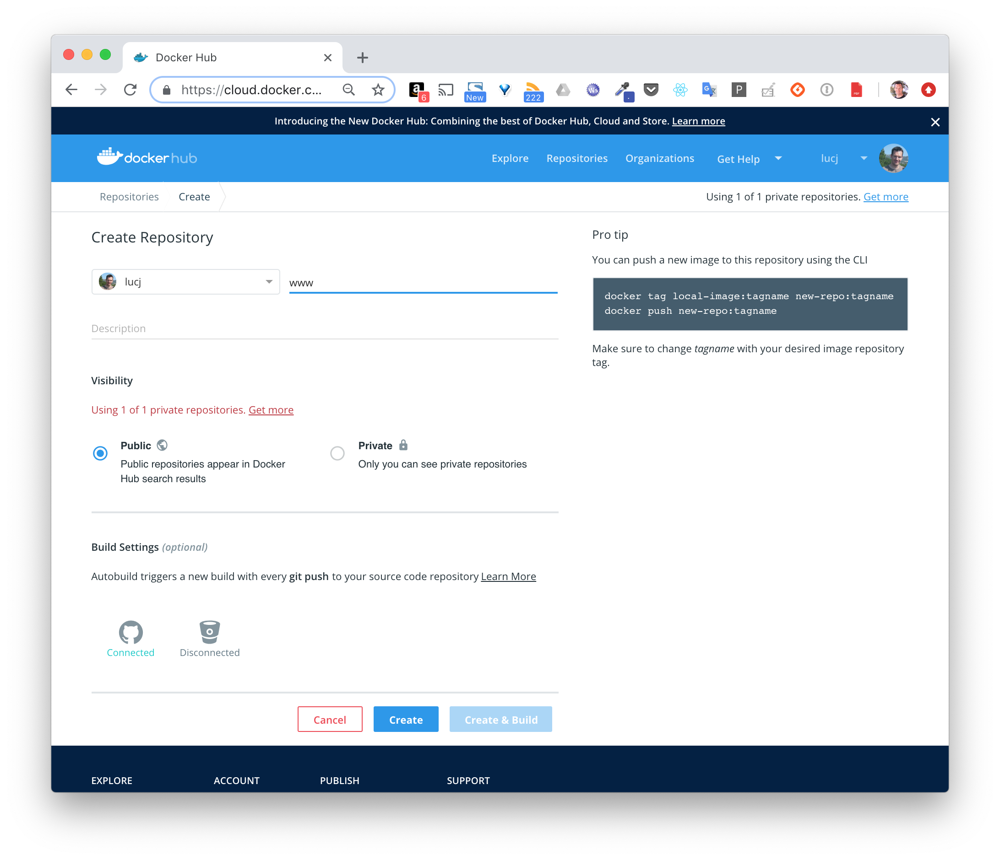
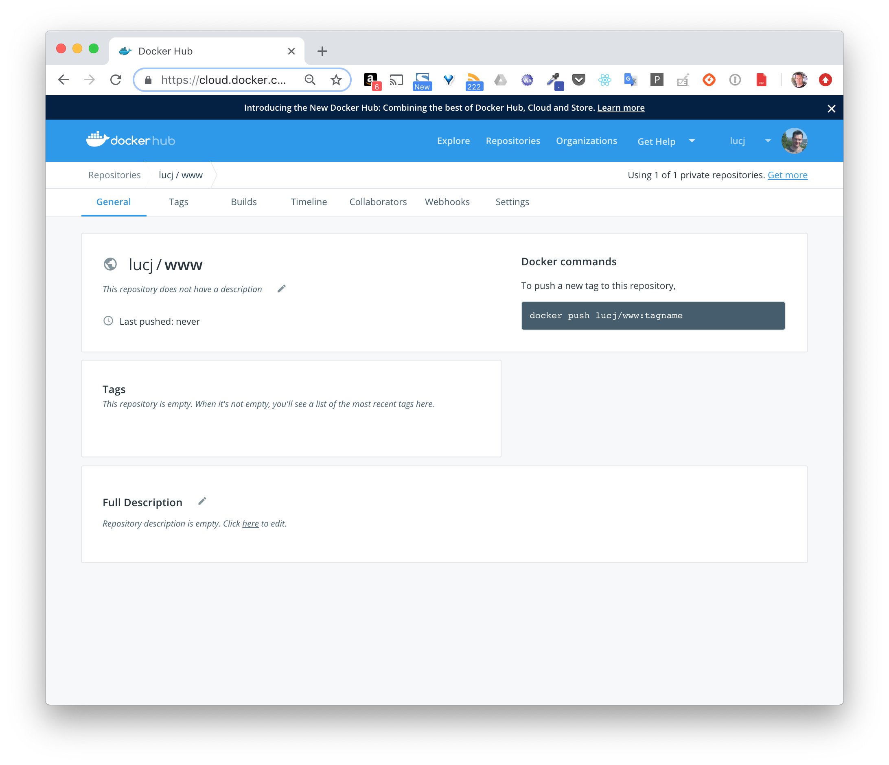
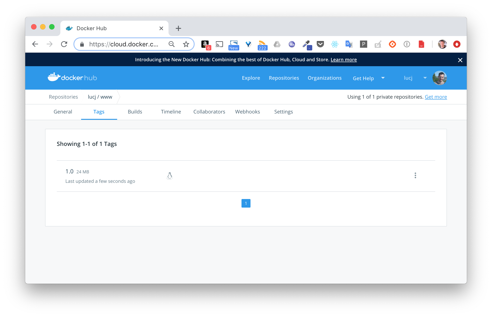

# Enoncé

Création d’un repository sur le Docker Hub

1. Créez un compte sur le Docker Hub

2. Créez le repository **www** avec la visibilité “public”

3. Effectuez un login depuis la ligne commande en spécifiant vos identifiants Docker Hub

4. Créez une image contenant un petit serveur web dans le language de votre choix et taggez la avec USERNAME/www:1.0

5. Uploadez l’image USERNAME/www:1.0 sur le Docker Hub

6. Confirmez que l’image est bien présente depuis l'interface web

---

# Correction

1. Il vous suffit de vous rendre sur l'URL http://hub.docker.com et de suivre la procédure de création de compte.

2. Une fois que vous êtes loggué sur le Docker Hub, cliquez sur le bouton "Create Repository" et créez le repository nommé **www** en laissant les valeurs par défaut.





3. Depuis la ligne de commande, lancez la commande suivante

```
$ docker login
```

Vous devrez alors renseigner votre nom d'utilisateur et votre mot de passe.

```
Login with your Docker ID to push and pull images from Docker Hub. If you don't have a Docker ID, head over to https://hub.docker.com to create one.
Username:
Password:
Login Succeeded
```

4. Exemple de serveur web simple en Node.js

Fichier **index.js**:

```
var express = require('express');
var util    = require('util');
var os      = require('os');
var app = express();
app.get('/', function(req, res) {
    res.setHeader('Content-Type', 'text/plain');
    res.end(util.format("hello from %s", os.hostname()));
});
app.listen(80);
```

Fichier **package.json**:
```
{
  "name": "hello",
  "version": "0.0.1",
  "main": "index.js",
  "scripts": {
    "start": "node index.js"
  },
   "dependencies": {  "express": "^4.14.0" }
}
```

Fichier **Dockerfile**:
```
FROM node:8.11-alpine
COPY package.json /app/package.json
RUN cd /app && npm install
COPY . /app/
WORKDIR /app
EXPOSE 80
CMD ["npm", "start"]
```

La commande suivante permet de builder l'image et de la tagger avec **USERNAME/www:1.0**
(modifiez USERNAME avec votre propre nom d'utilisateur)

```
$ docker image build -t USERNAME/www:1.0 . 
```

5. Afin d'uploader l'image sur le Docker Hub, on utilise la sous-commande push

```
$ docker image push USERNAME/www:1.0
```

Les différentes layers de l'image sont uploadées sur le Docker Hub.

6. La nouvelle image est bien visible depuis l'interface du Docker Hub


